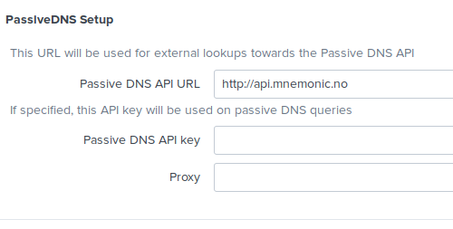
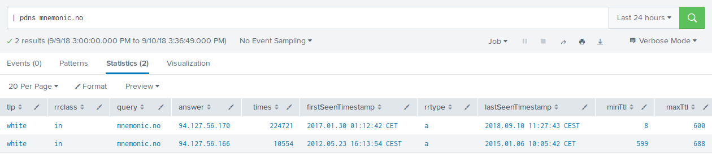
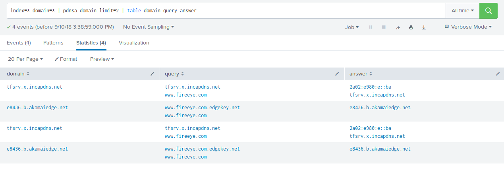

# pdns-splunk
pdns-splunk is a Splunk App that adds search and annotation from mnemonic Passive DNS (pdns).

# Installation
* Download the app from spunkbase

or

* clone repository and build

```
./build.sh
```

# Setup
After installation, enter app > pdns > Set up to enter information on API and optionally API key.



Without an API key you will be limited to 100 requests per minute and 1000 requests per day.

# Features

## Passive DNS Search
You can specify a generic search using the `pdns` command, to execute a search towards the Passive DNS API.

```
| pdns [<keyword>] [limit=<max results>]
```




## PDNS annotation
You can use the `pdnsa` command to annotate existing events with data from an PDNS:

```
.... | acta field1 [... fieldN] [limit=<max results>]
```


